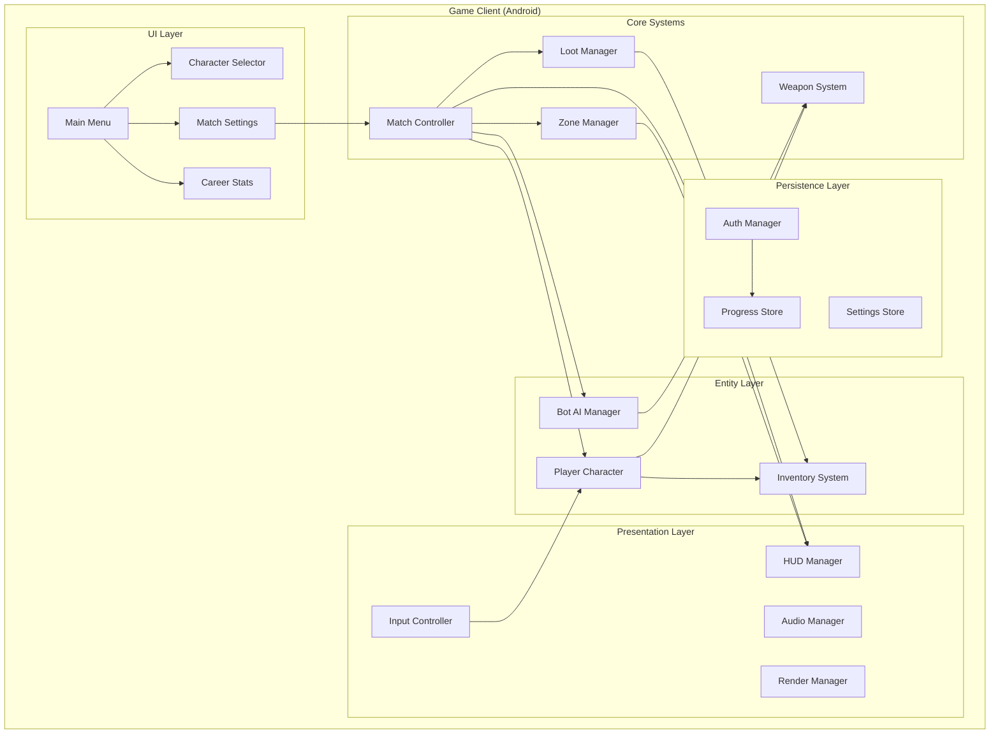
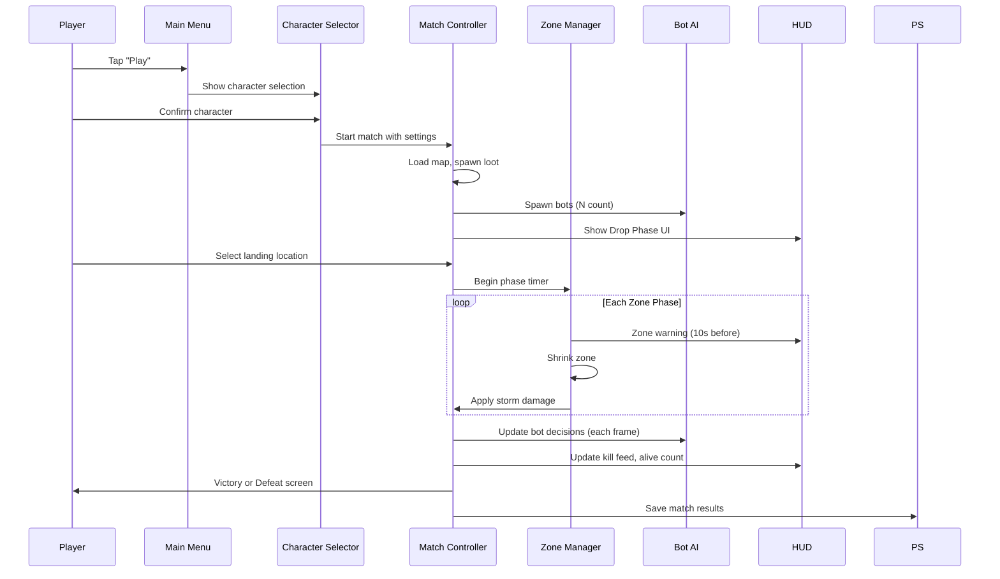
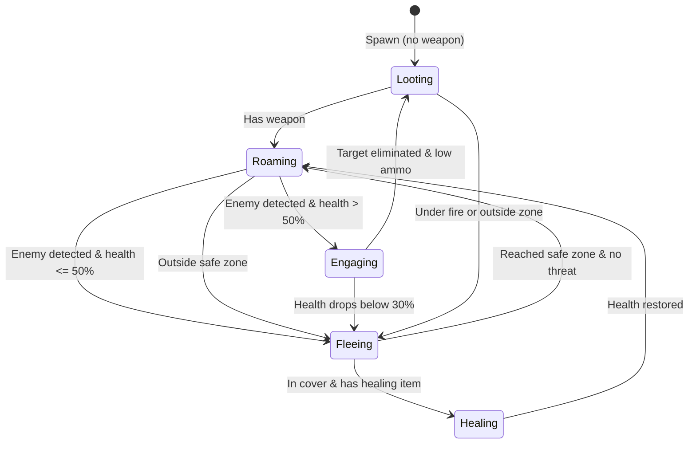
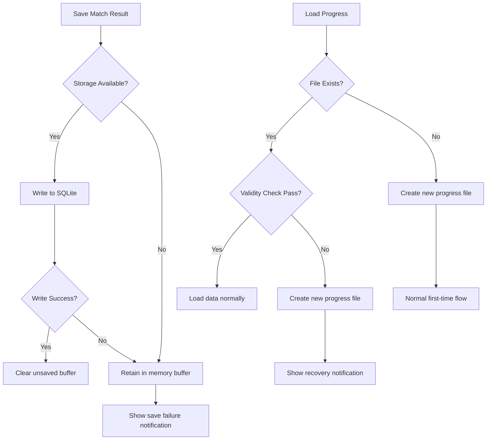

# Design Document: Battle Royale Offline

## Overview

This document describes the technical design for an offline Battle Royale mobile game targeting Android. The game delivers a complete battle royale experience — drop, loot, fight, survive — entirely on-device with no network dependency. Players compete against up to 99 rule-based bots in a shrinking zone, using weapons across 5 categories with 5 rarity tiers.

The game uses a Fortnite Lego-inspired art style (blocky, colorful, cartoonish) with 3 playable characters (Blitz, Titan, Phantom), each with male/female variants. The architecture prioritizes smooth mobile performance (30+ FPS on mid-range devices), intuitive touch controls, and local data persistence via SQLite.

**Engine Choice:** Godot 4.x (GDScript/C#) — selected for its lightweight runtime, strong 3D mobile support, open-source licensing, and built-in export to Android without additional fees. Godot's scene/node architecture maps well to the game's entity hierarchy.

**Key Design Decisions:**
- Entity-Component pattern for game objects (characters, bots, weapons, loot)
- Finite State Machine (FSM) for bot AI behavior
- Phase-driven match controller for zone and game state management
- SQLite for local progress persistence keyed by user ID/email
- Signal-based event system for decoupled HUD updates

## Architecture



### System Flow



### Architectural Principles

1. **Fully Offline**: Zero network calls during gameplay. Auth is one-time optional, then cached locally.
2. **Event-Driven Updates**: HUD and audio respond to signals/events from game systems, not polling.
3. **Deterministic Bot AI**: All bot behavior is rule-based FSM — reproducible given the same state.
4. **Phase-Driven Match**: Match progresses through well-defined phases (Lobby → Drop → Active → End).
5. **Resource Budget**: All assets fit within 500MB installed size; LOD and quality presets manage runtime memory.

## Components and Interfaces

### Match Controller

The central orchestrator managing match state and phase transitions.

```
MatchController
├── Properties
│   ├── match_state: MatchState (LOBBY, DROP, ACTIVE, ENDED)
│   ├── alive_count: int
│   ├── elapsed_time: float (seconds)
│   ├── match_settings: MatchSettings
│   └── match_stats: MatchStats
├── Methods
│   ├── start_match(settings: MatchSettings) → void
│   ├── begin_drop_phase() → void
│   ├── end_drop_phase() → void
│   ├── register_elimination(victim_id, killer_id) → void
│   ├── check_victory_condition() → bool
│   └── end_match(result: MatchResult) → void
└── Signals
    ├── match_state_changed(new_state: MatchState)
    ├── elimination_occurred(victim_id, killer_id, weapon)
    └── match_ended(result: MatchResult)
```

### Zone Manager

Controls the shrinking zone phases and storm damage.

```
ZoneManager
├── Properties
│   ├── current_phase: int
│   ├── total_phases: int (minimum 5)
│   ├── current_center: Vector2
│   ├── current_radius: float
│   ├── next_center: Vector2
│   ├── next_radius: float
│   ├── phase_state: PhaseState (WAITING, SHRINKING)
│   └── shrink_speed: ZoneShrinkSpeed (SLOW, NORMAL, FAST)
├── Methods
│   ├── initialize_zones(map_bounds: Rect2, speed: ZoneShrinkSpeed) → void
│   ├── advance_phase() → void
│   ├── get_storm_damage(phase: int) → float
│   ├── is_in_safe_zone(position: Vector2) → bool
│   └── get_nearest_safe_point(position: Vector2) → Vector2
└── Signals
    ├── zone_warning(seconds_remaining: int)
    ├── zone_shrink_started(phase: int)
    └── zone_shrink_completed(phase: int)
```

### Bot AI Manager

Manages all bot instances and their FSM-based decision making.

```
BotAIManager
├── Properties
│   ├── bots: Array[BotInstance]
│   ├── difficulty: Difficulty (EASY, MEDIUM, HARD)
│   └── engagement_range: float (50/75/100m by difficulty)
├── Methods
│   ├── spawn_bots(count: int, difficulty: Difficulty) → void
│   ├── update_all(delta: float) → void
│   ├── get_alive_bots() → Array[BotInstance]
│   └── eliminate_bot(bot_id: int) → void
└── BotInstance
    ├── state: BotState (LOOTING, ROAMING, ENGAGING, FLEEING, HEALING)
    ├── health: float
    ├── shield: float
    ├── inventory: BotInventory
    ├── reaction_timer: float
    ├── accuracy: float (range by difficulty)
    └── decide_action(context: BotContext) → BotAction
```

### Bot FSM States



### Weapon System

```
WeaponSystem
├── WeaponData (resource/config)
│   ├── category: WeaponCategory (AR, SHOTGUN, SMG, SNIPER, PISTOL)
│   ├── name: String ("Volt Repeater", "Boomstick", etc.)
│   ├── rarity: RarityTier (COMMON..LEGENDARY)
│   ├── base_damage: float
│   ├── fire_rate: float (rounds per second)
│   ├── magazine_size: int
│   ├── reload_time: float (seconds)
│   ├── effective_range: float (meters)
│   └── accuracy_base: float
├── Methods
│   ├── calculate_damage(weapon: WeaponData, distance: float) → float
│   ├── apply_rarity_modifier(base: float, rarity: RarityTier) → float
│   └── get_accuracy(weapon: WeaponData, rarity: RarityTier) → float
└── Constants
    ├── RARITY_DAMAGE_MULTIPLIER: 0.10 per tier
    ├── RARITY_ACCURACY_BONUS: 0.05 per tier
    └── DAMAGE_FALLOFF_ZERO: 2x effective range
```

### Inventory System

```
InventorySystem
├── Properties
│   ├── weapon_slots: Array[WeaponData?] (max 5)
│   ├── consumable_slots: Array[ConsumableStack] (max 3)
│   └── active_weapon_index: int
├── Methods
│   ├── add_weapon(weapon: WeaponData) → Result<void, InventoryFull>
│   ├── swap_weapon(slot: int, new_weapon: WeaponData) → WeaponData
│   ├── remove_weapon(slot: int) → WeaponData?
│   ├── add_consumable(item: ConsumableType, count: int) → Result<void, StackFull>
│   ├── use_consumable(type: ConsumableType) → Result<HealEffect, Error>
│   └── get_active_weapon() → WeaponData?
└── ConsumableStack
    ├── type: ConsumableType (BANDAGE, MEDKIT, SHIELD_POTION)
    ├── count: int
    └── max_stack: int (5 for bandage, 3 for medkit/shield)
```

### Loot Manager

```
LootManager
├── Properties
│   ├── spawn_points: Array[LootSpawnPoint]
│   ├── active_loot: Array[LootInstance]
│   └── rarity_weights: Dictionary<RarityTier, float>
├── Methods
│   ├── initialize_loot(map_data: MapData) → void
│   ├── spawn_loot_at(point: LootSpawnPoint) → LootInstance
│   ├── pick_up_loot(loot_id: int, picker: Entity) → Result<Item, Error>
│   └── get_nearest_loot(position: Vector2, radius: float) → LootInstance?
└── RarityWeights
    ├── COMMON: 0.40
    ├── UNCOMMON: 0.25
    ├── RARE: 0.20
    ├── EPIC: 0.10
    └── LEGENDARY: 0.05
```

### Input Controller

```
InputController
├── Properties
│   ├── joystick_active: bool
│   ├── joystick_displacement: Vector2
│   ├── sensitivity: float (1-10)
│   ├── fire_mode: FireMode (TAP, HOLD)
│   └── layout: ControlLayout
├── Methods
│   ├── process_touch(event: TouchEvent) → InputAction
│   ├── get_movement_vector() → Vector2
│   ├── get_aim_delta() → Vector2
│   └── is_action_pressed(action: String) → bool
└── Constraints
    ├── MIN_TOUCH_TARGET: 44dp x 44dp
    ├── MAX_INPUT_LATENCY: 50ms
    └── JOYSTICK_ACTIVATION: left-side touch area
```

### HUD Manager

```
HUDManager
├── Components
│   ├── HealthBar (health + shield, numeric + bar)
│   ├── WeaponDisplay (name, ammo, rarity color)
│   ├── Minimap (zone circles, player position, direction)
│   ├── KillFeed (last 5 eliminations, 5s timeout)
│   ├── AliveCounter (numeric, updates on elimination)
│   ├── Compass (cardinal directions + degree heading)
│   └── DamageIndicator (directional, 2s duration)
├── Methods
│   ├── update_health(health: float, shield: float) → void
│   ├── update_weapon(weapon: WeaponData, ammo: int, reserve: int) → void
│   ├── add_kill_feed_entry(entry: KillFeedEntry) → void
│   ├── show_damage_direction(source_direction: float) → void
│   └── show_storm_indicator(direction_to_safe: Vector2) → void
└── Update Policy: Signal-driven, within 1 frame of state change
```

### Audio Manager

```
AudioManager
├── Properties
│   ├── music_volume: float (0-100)
│   ├── sfx_volume: float (0-100)
│   ├── voice_volume: float (0-100)
│   └── spatial_audio_enabled: bool
├── Methods
│   ├── play_3d_sound(clip: AudioClip, position: Vector3, max_distance: float) → void
│   ├── play_ui_sound(clip: AudioClip) → void
│   ├── play_music(track: MusicTrack) → void
│   ├── play_storm_ambient() → void
│   └── play_own_footstep() → void  // lower volume, no spatialization
└── Distance Ranges
    ├── GUNSHOT_RANGE: 100m
    ├── FOOTSTEP_RANGE: 30m
    └── EXPLOSION_RANGE: 150m
```

### Progress Store

```
ProgressStore
├── Properties
│   ├── db: SQLiteDatabase
│   ├── current_user_id: String
│   └── unsaved_results: Array[MatchResult]  // retained on save failure
├── Methods
│   ├── initialize(user_id: String) → Result<void, DataCorrupted>
│   ├── save_match_result(result: MatchResult) → Result<void, StorageError>
│   ├── get_career_stats() → CareerStats
│   ├── get_match_history(limit: int) → Array[MatchResult]
│   ├── migrate_guest_to_account(guest_id: String, account_id: String) → Result<void, MigrationError>
│   └── validate_data_integrity() → bool
└── CareerStats
    ├── total_matches: int
    ├── wins: int
    ├── total_kills: int
    ├── avg_kills_per_match: float
    └── win_rate: float (percentage, 1 decimal)
```

### Auth Manager

```
AuthManager
├── Properties
│   ├── auth_state: AuthState (GUEST, AUTHENTICATED)
│   ├── user_id: String (UUID v4 for guest, email/social ID for auth)
│   └── provider: AuthProvider? (GOOGLE, FACEBOOK, EMAIL)
├── Methods
│   ├── generate_guest_id() → String (UUID v4, 36 chars)
│   ├── login(provider: AuthProvider, credentials: Credentials) → Result<UserProfile, AuthError>
│   ├── logout() → void
│   └── get_current_user_id() → String
└── Constraints
    ├── EMAIL_FORMAT: RFC 5322 valid
    └── PASSWORD_LENGTH: 8-64 characters
```

## Data Models

### Match Settings

```json
{
  "bot_count": 50,          // 10-99
  "bot_difficulty": "MEDIUM", // EASY, MEDIUM, HARD
  "zone_speed": "NORMAL",    // SLOW, NORMAL, FAST
  "estimated_duration_minutes": 15
}
```

### Match Result

```json
{
  "match_id": "uuid-v4",
  "timestamp": "ISO-8601",
  "placement": 1,
  "total_participants": 51,
  "kills": 8,
  "damage_dealt": 1250.5,
  "survival_time_seconds": 842,
  "character": "BLITZ",
  "variant": "MALE",
  "bot_difficulty": "MEDIUM",
  "bot_count": 50
}
```

### Player Progress (SQLite Schema)

```sql
CREATE TABLE player_profile (
    user_id TEXT PRIMARY KEY,
    auth_provider TEXT,  -- 'guest', 'google', 'facebook', 'email'
    selected_character TEXT DEFAULT 'BLITZ',
    selected_variant TEXT DEFAULT 'MALE',
    created_at TEXT,
    last_played_at TEXT
);

CREATE TABLE match_history (
    match_id TEXT PRIMARY KEY,
    user_id TEXT NOT NULL,
    timestamp TEXT NOT NULL,
    placement INTEGER NOT NULL,
    total_participants INTEGER NOT NULL,
    kills INTEGER NOT NULL,
    damage_dealt REAL NOT NULL,
    survival_time_seconds INTEGER NOT NULL,
    character_name TEXT NOT NULL,
    character_variant TEXT NOT NULL,
    bot_difficulty TEXT NOT NULL,
    bot_count INTEGER NOT NULL,
    FOREIGN KEY (user_id) REFERENCES player_profile(user_id)
);

CREATE TABLE settings (
    user_id TEXT PRIMARY KEY,
    sensitivity REAL DEFAULT 5.0,
    fire_mode TEXT DEFAULT 'TAP',
    graphics_quality TEXT DEFAULT 'MEDIUM',
    music_volume INTEGER DEFAULT 70,
    sfx_volume INTEGER DEFAULT 80,
    voice_volume INTEGER DEFAULT 80,
    control_layout TEXT,  -- JSON blob for custom positions
    FOREIGN KEY (user_id) REFERENCES player_profile(user_id)
);
```

### Weapon Configuration Data

```json
{
  "weapons": [
    {
      "category": "AR",
      "name": "Volt Repeater",
      "base_damage": 30,
      "fire_rate_rps": 5,
      "magazine_size": 30,
      "reload_time_seconds": 2.0,
      "effective_range_meters": 50,
      "base_accuracy": 0.75
    },
    {
      "category": "SHOTGUN",
      "name": "Boomstick",
      "base_damage": 90,
      "fire_rate_rps": 1,
      "magazine_size": 5,
      "reload_time_seconds": 4.0,
      "effective_range_meters": 10,
      "base_accuracy": 0.60
    },
    {
      "category": "SMG",
      "name": "Buzzer",
      "base_damage": 18,
      "fire_rate_rps": 8,
      "magazine_size": 25,
      "reload_time_seconds": 1.5,
      "effective_range_meters": 30,
      "base_accuracy": 0.65
    },
    {
      "category": "SNIPER",
      "name": "Longshot",
      "base_damage": 100,
      "fire_rate_rps": 0.5,
      "magazine_size": 5,
      "reload_time_seconds": 3.0,
      "effective_range_meters": 150,
      "base_accuracy": 0.90
    },
    {
      "category": "PISTOL",
      "name": "Sideswipe",
      "base_damage": 24,
      "fire_rate_rps": 3,
      "magazine_size": 12,
      "reload_time_seconds": 1.0,
      "effective_range_meters": 35,
      "base_accuracy": 0.70
    }
  ]
}
```

### Zone Phase Configuration

```json
{
  "phases": [
    { "phase": 1, "safe_radius_percent": 70, "wait_seconds": 120, "shrink_seconds": 60, "storm_dps": 1 },
    { "phase": 2, "safe_radius_percent": 50, "wait_seconds": 90, "shrink_seconds": 50, "storm_dps": 2 },
    { "phase": 3, "safe_radius_percent": 30, "wait_seconds": 60, "shrink_seconds": 40, "storm_dps": 3 },
    { "phase": 4, "safe_radius_percent": 15, "wait_seconds": 45, "shrink_seconds": 30, "storm_dps": 5 },
    { "phase": 5, "safe_radius_percent": 5, "wait_seconds": 30, "shrink_seconds": 20, "storm_dps": 8 }
  ],
  "speed_multipliers": {
    "SLOW": 1.5,
    "NORMAL": 1.0,
    "FAST": 0.6
  }
}
```

### Consumable Item Data

```json
{
  "consumables": [
    {
      "type": "BANDAGE",
      "heal_amount": 25,
      "heal_target": "HEALTH",
      "use_time_seconds": 3,
      "max_stack": 5,
      "cap": 75
    },
    {
      "type": "MEDKIT",
      "heal_amount": 100,
      "heal_target": "HEALTH",
      "use_time_seconds": 8,
      "max_stack": 3,
      "cap": 100
    },
    {
      "type": "SHIELD_POTION",
      "heal_amount": 50,
      "heal_target": "SHIELD",
      "use_time_seconds": 4,
      "max_stack": 3,
      "cap": 100
    }
  ]
}
```

### Character Data

```json
{
  "characters": [
    {
      "id": "BLITZ",
      "name": "Blitz",
      "description": "Nimble scout with sporty build",
      "primary_color": "#FF6B35",
      "variants": ["MALE", "FEMALE"],
      "silhouette": "slim_capped"
    },
    {
      "id": "TITAN",
      "name": "Titan",
      "description": "Bulky heavy with armored plating",
      "primary_color": "#2E86AB",
      "variants": ["MALE", "FEMALE"],
      "silhouette": "broad_helmeted"
    },
    {
      "id": "PHANTOM",
      "name": "Phantom",
      "description": "Sleek stealth with hooded cloak",
      "primary_color": "#7B2D8B",
      "variants": ["MALE", "FEMALE"],
      "silhouette": "slim_hooded"
    }
  ]
}
```


## Correctness Properties

*A property is a characteristic or behavior that should hold true across all valid executions of a system — essentially, a formal statement about what the system should do. Properties serve as the bridge between human-readable specifications and machine-verifiable correctness guarantees.*

### Property 1: Match spawn correctness

*For any* valid bot count setting (10-99), when a match is initialized, the total number of spawned participants SHALL equal the bot count plus 1 (the player), and all bot landing positions SHALL be within the map boundaries.

**Validates: Requirements 1.1, 1.8**

### Property 2: Auto-drop position validity

*For any* zone configuration and map bounds, when the drop phase timer expires without player input, the auto-assigned landing position SHALL be within the current safe zone boundary.

**Validates: Requirements 1.2**

### Property 3: Storm damage calculation

*For any* zone phase number P and time duration T spent in the storm, the total storm damage applied SHALL equal the phase's configured damage-per-second multiplied by T, where phase DPS starts at 1 and increases by at least 1 per successive phase.

**Validates: Requirements 1.4, 6.5**

### Property 4: Character selection round-trip

*For any* valid character ID and variant combination, saving the selection to the progress store and then loading it back SHALL return the identical character ID and variant.

**Validates: Requirements 2.5**

### Property 5: Character assignment validity

*For any* spawned bot, the assigned character model SHALL be one of the 3 valid characters (Blitz, Titan, Phantom) with a valid variant (Male, Female), and no two characters in the game's character set SHALL share the same primary color hue.

**Validates: Requirements 3.3, 3.5**

### Property 6: Weapon damage calculation

*For any* weapon category, rarity tier, and target distance, the calculated damage SHALL equal: base_damage × (1 + 0.10 × rarity_index) when distance ≤ effective_range; linearly interpolated from full damage to 50% damage between effective_range and 2× effective_range; and exactly zero beyond 2× effective_range.

**Validates: Requirements 4.4, 4.5**

### Property 7: Loot rarity distribution

*For any* sufficiently large sample of loot spawns (N ≥ 1000), the observed frequency of each rarity tier SHALL approximate the configured weights (Common 40%, Uncommon 25%, Rare 20%, Epic 10%, Legendary 5%) within a statistical tolerance of ±5 percentage points.

**Validates: Requirements 4.6**

### Property 8: Inventory capacity invariant

*For any* sequence of item pickup operations, the inventory SHALL never contain more than 5 weapons, never contain more than 3 consumable stacks, and each consumable stack SHALL never exceed its type's maximum (5 for bandages, 3 for medkits, 3 for shield potions). Pickup attempts when at capacity SHALL be rejected without modifying inventory state.

**Validates: Requirements 4.3, 7.2, 7.4**

### Property 9: Empty magazine blocks firing

*For any* weapon with 0 rounds in its magazine, attempting to fire SHALL produce no damage output and SHALL trigger a reload prompt, and the weapon SHALL not fire until a reload of the correct duration for its category has completed.

**Validates: Requirements 4.8**

### Property 10: Bot FSM decision correctness

*For any* bot state (health, weapon status, zone position, enemy proximity, inventory), the bot's chosen action SHALL follow the priority rules: (1) if unarmed and not in danger → loot; (2) if outside safe zone → move toward zone; (3) if enemy in range and health > 50% and armed → engage; (4) if enemy in range and (health ≤ 50% or unarmed) → flee; (5) if health < 30% → disengage and heal if possible; (6) if armed, in zone, no enemy → roam.

**Validates: Requirements 5.2, 5.4, 5.7, 5.8**

### Property 11: Bot movement toward safe zone

*For any* bot positioned outside the safe zone boundary, the bot's movement vector SHALL have a positive dot product with the vector pointing from the bot's position toward the nearest point on the safe zone boundary (i.e., the bot moves closer to safety).

**Validates: Requirements 5.3**

### Property 12: Bot difficulty parameters

*For any* difficulty level, the bot's reaction time SHALL fall within the specified range (Easy: 1500-2000ms, Medium: 800-1200ms, Hard: 300-600ms) and hit-rate accuracy SHALL fall within the specified range (Easy: 15-25%, Medium: 30-45%, Hard: 55-70%).

**Validates: Requirements 5.5, 5.6**

### Property 13: Zone configuration validity

*For any* generated zone phase sequence, there SHALL be at least 5 phases, each phase's wait time SHALL be between 30 and 120 seconds, each phase's shrink duration SHALL be strictly between 20 and 90 seconds, the first safe zone SHALL cover no more than 70% of the total map area, and the final safe zone radius SHALL be no larger than 50 meters.

**Validates: Requirements 6.2, 6.6**

### Property 14: Zone warning timing

*For any* zone phase with wait time W seconds, the zone shrink warning SHALL fire at time T where T ≤ W - 10 (i.e., at least 10 seconds before shrinking begins).

**Validates: Requirements 6.3**

### Property 15: Storm indicators paired display

*For any* HUD state while the player is in the storm, either both the damage indicator and directional guide are displayed, or neither is displayed. A state where only one is rendered SHALL NOT occur.

**Validates: Requirements 6.4**

### Property 16: Next zone containment

*For any* zone transition, the next zone circle SHALL be fully contained within the current zone circle, meaning: distance(current_center, next_center) + next_radius ≤ current_radius.

**Validates: Requirements 6.7**

### Property 17: Map loot distribution constraints

*For any* valid map configuration, named locations SHALL have at least 3× the loot spawn density of open areas, each named location SHALL contain at least 5 loot spawn points, all named locations SHALL be separated by at least 100 meters, and each terrain type SHALL cover at least 15% of the total map area.

**Validates: Requirements 7.1, 11.1, 11.2, 11.7**

### Property 18: Healing calculation with caps

*For any* player health/shield state and consumable type used, the resulting value SHALL equal min(current + heal_amount, cap) where caps are: bandage heals 25 HP capped at 75, medkit heals to full (100), shield potion heals 50 shield capped at 100. Additionally, bandage use SHALL be blocked when current health ≥ 75.

**Validates: Requirements 7.3**

### Property 19: Cancelled healing consumes item

*For any* healing action that is interrupted before the usage animation completes, the consumable item SHALL be removed from inventory AND no healing effect SHALL be applied to the player's health or shield.

**Validates: Requirements 7.7**

### Property 20: Kill feed queue management

*For any* sequence of elimination events with timestamps, the kill feed SHALL display at most 5 entries at any given time, and each entry SHALL be removed exactly 5 seconds after it was added.

**Validates: Requirements 8.4**

### Property 21: Alive count tracking

*For any* match starting with N participants and a sequence of K elimination events, the displayed alive count SHALL equal N - K at all times after the K-th elimination.

**Validates: Requirements 8.5**

### Property 22: Compass heading calculation

*For any* player facing direction expressed as an angle (0-360 degrees), the compass SHALL display the correct degree heading and position cardinal direction markers (N, S, E, W) at their correct relative positions.

**Validates: Requirements 8.6**

### Property 23: Control layout constraints

*For any* custom control layout configuration, all interactive elements SHALL have dimensions ≥ 44×44 density-independent pixels, all elements SHALL be fully within screen bounds, and no two interactive elements SHALL overlap.

**Validates: Requirements 9.3, 9.5**

### Property 24: Joystick movement proportionality

*For any* joystick displacement vector from center, the character's movement speed SHALL be proportional to the displacement magnitude (clamped at joystick radius), and the movement direction SHALL match the displacement direction.

**Validates: Requirements 9.8**

### Property 25: User identity and auth validation

*For any* generated guest ID, it SHALL conform to UUID v4 format (36 characters, correct hyphen positions, version nibble = 4). *For any* email input, validation SHALL accept only RFC 5322 compliant addresses. *For any* password input, validation SHALL accept only strings of length 8-64 characters.

**Validates: Requirements 10.1, 10.2**

### Property 26: Progress data integrity

*For any* set of match results saved to the progress store, loading the match history SHALL return all saved results with identical field values, and the computed career statistics SHALL equal: total_matches = count(results), wins = count(placement == 1), total_kills = sum(kills), avg_kills = total_kills / total_matches, win_rate = (wins / total_matches) × 100 rounded to 1 decimal place.

**Validates: Requirements 10.3, 10.5**

### Property 27: User data isolation

*For any* two distinct user IDs, match results saved under one user ID SHALL NOT appear when querying the other user ID's match history or career statistics.

**Validates: Requirements 10.4**

### Property 28: Guest-to-account migration

*For any* guest user with existing progress data, after successful migration to an authenticated account, all match history and career statistics SHALL be accessible under the new account ID and SHALL no longer be accessible under the original guest ID.

**Validates: Requirements 10.7**

### Property 29: Audio distance attenuation

*For any* sound source at distance D from the player, the audio volume SHALL attenuate with distance and SHALL be zero when D exceeds the source type's maximum range (gunshots: 100m, footsteps: 30m, explosions: 150m).

**Validates: Requirements 12.1**

### Property 30: Settings value clamping

*For any* numeric setting input (sensitivity 1-10, volume 0-100), the stored and applied value SHALL be clamped to the valid range, rejecting or clamping values outside the bounds.

**Validates: Requirements 9.2, 12.4**

### Property 31: Adaptive quality reduction

*For any* device memory state below 200MB during a match where the current graphics quality is not already at the lowest preset, the system SHALL reduce quality by exactly one preset level.

**Validates: Requirements 13.5**

### Property 32: Match settings validation

*For any* match settings configuration, the system SHALL accept bot counts in range 10-99 and reject values outside this range, SHALL compute estimated match duration as a function of bot count and zone speed (rounded to nearest minute, minimum 1), and SHALL block match confirmation until all settings are valid.

**Validates: Requirements 15.2, 15.4, 15.5**


## Error Handling

### Categories

| Category | Handling Strategy | User Impact |
|----------|------------------|-------------|
| Storage failure (save) | Retain unsaved data in memory, retry on next save opportunity, notify player | Warning notification, no data loss during session |
| Storage failure (load) | Create fresh progress file, show data recovery notification | One-time notification, fresh start |
| Character model load failure | Show error with retry/alternate character option, timeout at 5s | Brief delay, player can retry or pick different character |
| Memory pressure (< 200MB) | Auto-reduce graphics quality by one level, show indicator | Brief quality indicator, smoother gameplay |
| Critical memory (< 100MB at lowest quality) | Preserve match state, display warning about potential match end | Warning dialog, match state saved |
| Guest-to-account migration failure | Proceed with login, discard guest progress | Login succeeds, old progress lost (acceptable per requirements) |
| Audio system unavailable | Silent failure, gameplay continues uninterrupted | No audio, no crash |
| HUD indicator render failure (storm) | Hide both damage indicator and directional guide | Reduced information, consistent state |
| Healing animation interrupted | Consume item, cancel healing effect | Item lost, no health gained |
| Touch input exceeding 50ms latency | Reject the input entirely | Missed input, maintains responsiveness standard |

### Error Recovery Flows



### Graceful Degradation Hierarchy

1. **Graphics Quality**: High → Medium → Low (automatic on memory pressure)
2. **Audio**: Full spatial → Reduced → Silent (on audio system failure)
3. **HUD Elements**: Full → Partial (paired indicators hide together)
4. **Match State**: Active → Preserved → Warning (on critical memory)

### Input Validation Boundaries

| Input | Valid Range | On Invalid |
|-------|------------|------------|
| Bot count | 10-99 | Block match confirmation |
| Sensitivity | 1-10 | Clamp to nearest valid value |
| Volume (all channels) | 0-100 | Clamp to nearest valid value |
| Password length | 8-64 chars | Reject with validation message |
| Email format | RFC 5322 | Reject with validation message |
| Zone shrink duration | 20-90 seconds (exclusive bounds) | Reject configuration |
| Zone wait time | 30-120 seconds | Reject configuration |
| Weapon slots | 0-5 | Block pickup when at 5 |
| Consumable stacks | 0-3 | Block pickup when at 3 |

## Testing Strategy

### Dual Testing Approach

This project uses both unit tests and property-based tests for comprehensive coverage:

- **Property-based tests** verify universal correctness properties across randomized inputs (game logic, calculations, state machines)
- **Unit tests** verify specific examples, edge cases, integration points, and UI behavior
- **Integration tests** verify system-level behavior (performance, timing, platform compatibility)

### Property-Based Testing Configuration

**Library:** GdUnit4 with custom property-based testing utilities (or GUT with a PBT extension for Godot)

For pure logic modules that can be tested outside the engine, use a standalone testing approach:
- **Alternative:** Extract core logic (damage calc, inventory, zone math, bot FSM, progress store) into pure GDScript/C# classes testable with a PBT framework
- **Framework:** If using C# scripting in Godot: FsCheck or Hedgehog for .NET
- **Framework:** If using GDScript: Custom property test runner using `RandomNumberGenerator` with configurable seed and iteration count

**Configuration:**
- Minimum 100 iterations per property test
- Configurable seed for reproducibility
- Each test tagged with: `Feature: battle-royale-offline, Property {N}: {title}`

### Property Test Coverage Map

| Property | Module Under Test | Generator Strategy |
|----------|------------------|-------------------|
| 1: Match spawn | MatchController | Random bot counts (10-99) |
| 2: Auto-drop position | MatchController | Random zone configs + map bounds |
| 3: Storm damage | ZoneManager | Random phases × durations |
| 4: Character selection round-trip | ProgressStore | All 6 character+variant combos |
| 5: Character assignment | BotAIManager | Random bot spawns |
| 6: Weapon damage | WeaponSystem | Random weapon × rarity × distance |
| 7: Loot rarity distribution | LootManager | Large sample generation (N=1000+) |
| 8: Inventory capacity | InventorySystem | Random pickup sequences |
| 9: Empty magazine | WeaponSystem | Random weapons at 0 ammo |
| 10: Bot FSM decisions | BotAI | Random bot state combinations |
| 11: Bot zone movement | BotAI | Random positions outside zone |
| 12: Bot difficulty params | BotAI | All 3 difficulty levels × random instances |
| 13: Zone config validity | ZoneManager | Random phase configurations |
| 14: Zone warning timing | ZoneManager | Random wait times |
| 15: Storm indicators | HUDManager | Random render success/failure states |
| 16: Next zone containment | ZoneManager | Random circle pairs |
| 17: Map loot distribution | LootManager + MapData | Random map configurations |
| 18: Healing calculation | InventorySystem | Random health states × consumable types |
| 19: Cancelled healing | InventorySystem | Random interruption timings |
| 20: Kill feed queue | HUDManager | Random elimination sequences |
| 21: Alive count | MatchController | Random elimination sequences |
| 22: Compass heading | HUDManager | Random angles (0-360) |
| 23: Control layout | InputController | Random element positions + sizes |
| 24: Joystick movement | InputController | Random displacement vectors |
| 25: User identity | AuthManager | Random strings for UUID/email/password |
| 26: Progress data integrity | ProgressStore | Random match result sets |
| 27: User data isolation | ProgressStore | Random user ID pairs + data |
| 28: Migration | ProgressStore | Random guest progress + account IDs |
| 29: Audio attenuation | AudioManager | Random distances × source types |
| 30: Settings clamping | SettingsStore | Random numeric inputs |
| 31: Adaptive quality | RenderManager | Random memory states |
| 32: Match settings validation | MatchSettings | Random setting combinations |

### Unit Test Focus Areas

Unit tests complement property tests by covering:

1. **Specific examples**: Victory condition when exactly 1 player remains, defeat screen on player elimination
2. **UI state transitions**: Menu navigation, HUD element visibility toggling, drop phase label show/hide
3. **Edge cases**: Zero health, maximum inventory, boundary zone positions
4. **Integration points**: SQLite read/write operations, audio clip mapping, input event routing
5. **Error scenarios**: Corrupted save file handling, audio system unavailability, memory warnings

### Test Organization

```
tests/
├── property/
│   ├── test_weapon_damage.gd          # Properties 6, 9
│   ├── test_inventory.gd              # Properties 8, 18, 19
│   ├── test_zone_mechanics.gd         # Properties 3, 13, 14, 16
│   ├── test_bot_ai.gd                 # Properties 10, 11, 12
│   ├── test_match_controller.gd       # Properties 1, 2, 21
│   ├── test_loot_distribution.gd      # Properties 7, 17
│   ├── test_progress_store.gd         # Properties 4, 26, 27, 28
│   ├── test_hud.gd                    # Properties 15, 20, 22
│   ├── test_input.gd                  # Properties 23, 24, 30
│   ├── test_auth.gd                   # Property 25
│   ├── test_audio.gd                  # Property 29
│   ├── test_settings.gd              # Properties 31, 32
│   └── test_character.gd             # Property 5
├── unit/
│   ├── test_match_lifecycle.gd
│   ├── test_character_selection.gd
│   ├── test_hud_display.gd
│   ├── test_menu_navigation.gd
│   ├── test_error_handling.gd
│   └── test_audio_mapping.gd
└── integration/
    ├── test_performance.gd
    ├── test_sqlite_operations.gd
    └── test_full_match_flow.gd
```

### Test Execution

- Property tests run with `--iterations=100` minimum per property
- All tests run offline (no network mocking needed — the game has no network calls)
- Tests use deterministic seeds for reproducibility in CI
- Performance/integration tests run on device or emulator targeting API 26+
